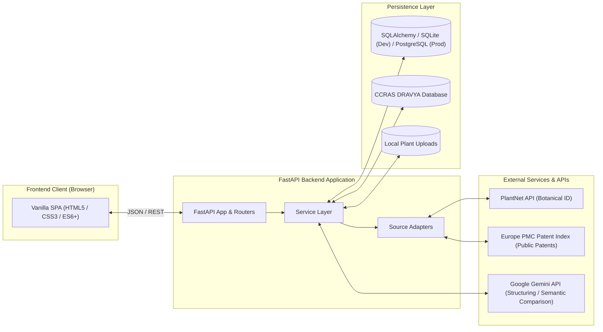
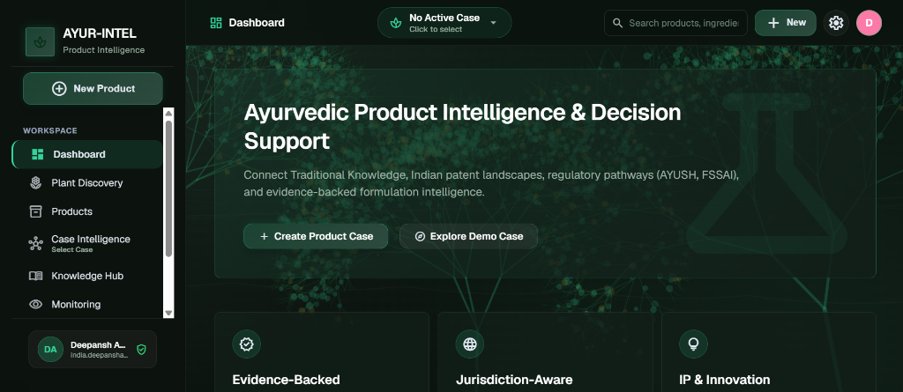
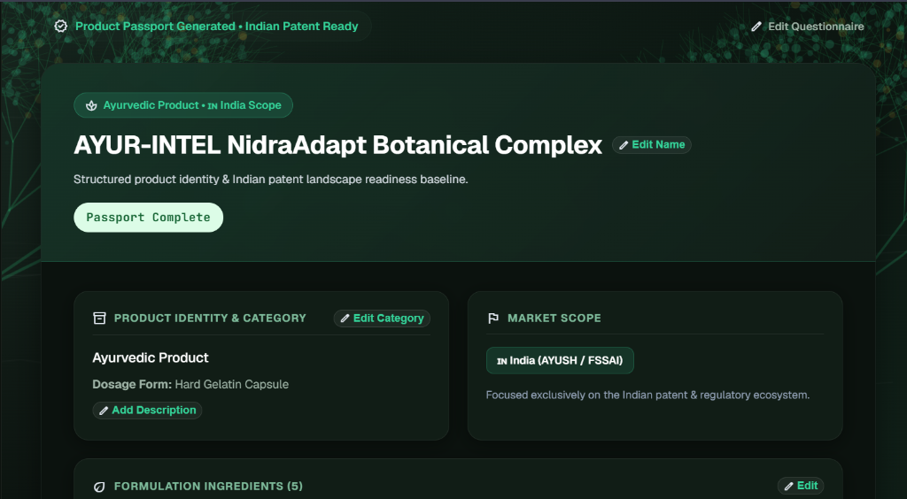
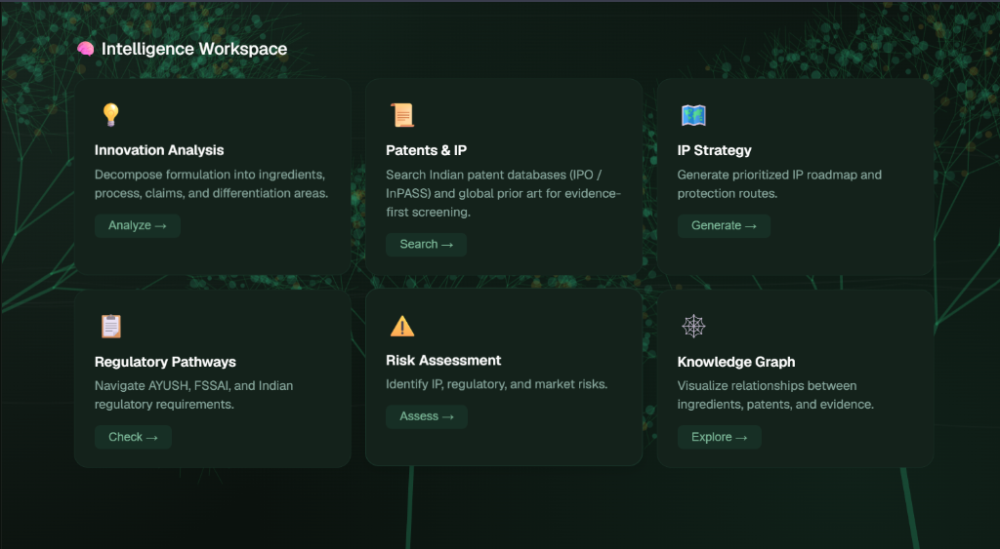
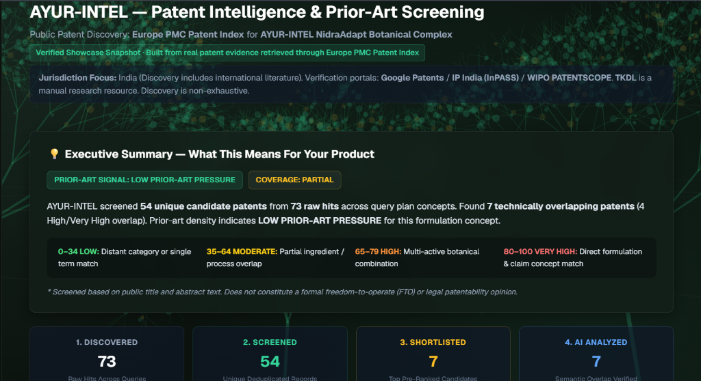
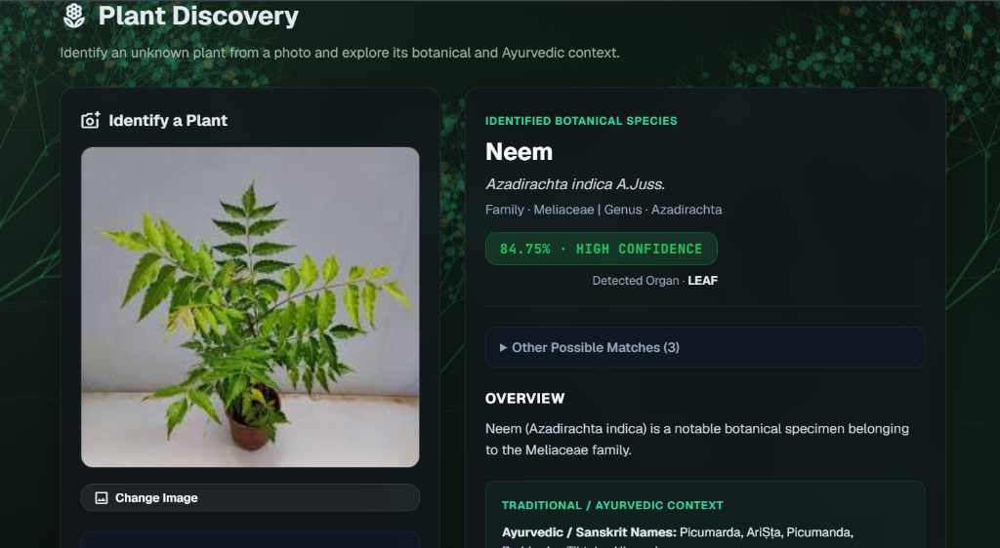
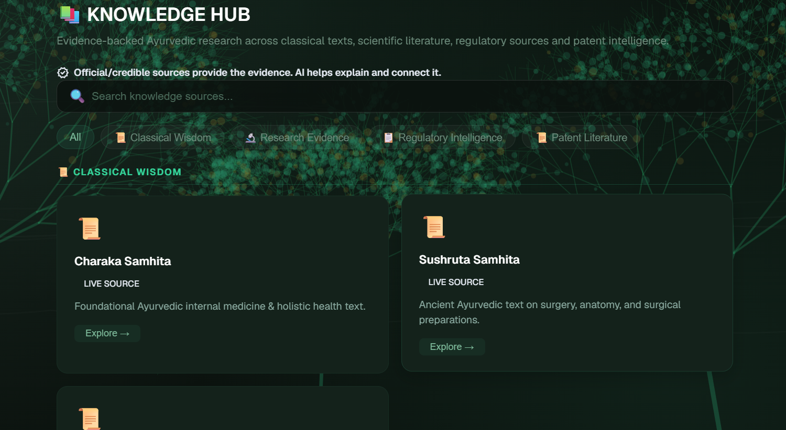
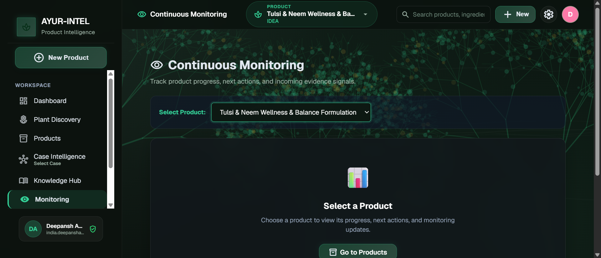

# AYUR-INTEL

> **Evidence-backed intelligence and decision-support for Ayurvedic product development.**

[](https://www.python.org/)
[](https://fastapi.tiangolo.com/)
[](https://www.sqlalchemy.org/)
[](https://render.com/)

---

## Table of Contents

- [Overview](#overview)
- [Problem Statement](#problem-statement)
- [Solution](#solution)
- [Core Principles](#core-principles)
- [Key Features](#key-features)
  - [Product Passport](#1-product-passport)
  - [Case Intelligence Workspace](#2-case-intelligence-workspace)
  - [Patent Intelligence & Prior-Art Screening](#3-patent-intelligence--prior-art-screening)
  - [Plant Discovery](#4-plant-discovery)
  - [Knowledge Hub](#5-knowledge-hub)
  - [Product Monitoring](#6-product-monitoring)
- [Demonstration Case](#demonstration-case)
- [System Architecture](#system-architecture)
- [Tech Stack](#tech-stack)
- [Evidence Pipeline](#evidence-pipeline)
- [Specialized Pipelines](#specialized-pipelines)
  - [Patent Intelligence Pipeline](#patent-intelligence-pipeline)
  - [Plant Discovery Pipeline](#plant-discovery-pipeline)
- [Repository Structure](#repository-structure)
- [Installation & Local Setup](#installation--local-setup)
- [Environment Variables](#environment-variables)
- [Running the Application](#running-the-application)
- [Running Tests](#running-tests)
- [Product Tour & Screenshots](#product-tour--screenshots)
- [Current Prototype Scope](#current-prototype-scope)
- [Current Limitations](#current-limitations)
- [Scalability Roadmap](#scalability-roadmap)
- [Future Roadmap](#future-roadmap)
- [Safety & Disclaimer](#safety--disclaimer)
- [Team & Acknowledgments](#team--acknowledgments)
- [License](#license)

---

## Overview

**AYUR-INTEL** is an India-focused Ayurvedic and herbal product intelligence platform engineered for formulation scientists, regulatory specialists, intellectual property analysts, and Ayurvedic brand developers.

The platform transforms unstructured Ayurvedic formulation ideas into structured product cases, bridges traditional Ayurvedic knowledge with modern pharmacological research, provides preliminary prior-art patent screening, analyzes regulatory pathways (Ministry of AYUSH and FSSAI), and monitors product compliance and evidence signals across the product development lifecycle.

---

## Problem Statement

Ayurvedic and herbal product developers currently navigate a fragmented, high-risk landscape characterized by disconnected information silos:

1. **Disconnected Knowledge Sources**: Classical Ayurvedic literature (*Charaka Samhita*, *Sushruta Samhita*, *Ashtanga Hridaya*, CCRAS DRAVYA) exists separately from modern scientific and pharmacological research (PubMed / PMC).
2. **Complex Multi-Jurisdiction Regulatory Pathways**: Formulators struggle to distinguish between Ayurvedic Proprietary Medicines (governed by the Drugs and Cosmetics Act 1940 and AYUSH rules) and Ayurvedic Aahara / Nutraceutical categories (governed by FSSAI Nutraceutical Regulations 2022).
3. **Fragmented Patent Prior-Art Screening**: Formulators often discover prior-art patent disclosures or conflicting composition claims late in commercialization due to inadequate early-stage patent discovery across Indian and international patent literature.
4. **Lack of Evidence Traceability**: Product claims, botanical choices, and processing methods often lack transparent, audit-ready citations back to authoritative classical samhitās, peer-reviewed studies, or pharmacopoeial standards.

---

## Solution

AYUR-INTEL unifies product formulation and evidence discovery through a coherent, product-anchored workflow:

```text
Product Definition
   │
   ▼
Product Passport (Structured Identity, Ingredients, Dosages, Market Scope)
   │
   ▼
Case Intelligence Workspace (Innovation Analysis, Patents & IP, Strategy, Regulatory, Risk, Knowledge Graph)
   │
   ▼
Patent, Regulatory & Evidence Intelligence (Prior-Art Screening, Dual-Track Compliance, Citations)
   │
   ▼
Knowledge Exploration (Classical Samhitas, Modern Research, CCRAS DRAVYA Taxonomy)
   │
   ▼
Monitoring & Next Actions (Workflow Milestones, Evidence Signals, Review States)
```

---

## Core Principles

### Source First, AI Second
- **AI-generated text is never treated as evidence**: Language models do not generate classical texts, legal clauses, or patent citations.
- **Traceability to authentic sources**: Every finding, risk alert, and patent result is anchored to a primary record (e.g., Europe PMC patent record, NIIMH Samhita reference, FSSAI schedule clause, or CCRAS Dravya monograph).
- **Bounded AI assistance**: Google Gemini is employed strictly for structured parsing, normalization, semantic comparison against retrieved texts, and contextual synthesis.

### Evidence Traceability & Content Provenance
- All ingested evidence items preserve primary identifiers, source URLs, publication years, and cryptographic content hashes (`content_hash`) to ensure provenance and prevent drift.

### India-Focused Scope
- Grounded in the Indian legal and regulatory landscape: Ministry of AYUSH, Drugs & Cosmetics Act 1940 & Rules 1945, and FSSAI Nutraceutical Regulations 2022.
- Patent discovery applies an explicit Indian lens while capturing relevant international prior-art literature.

---

## Key Features

### 1. Product Passport
The Product Passport serves as the single source of truth for an Ayurvedic formulation:
- **Product Identity & Category**: Category selection (Ayurvedic Classical, Ayurvedic Proprietary Medicine, Ayurvedic Aahara / Nutraceutical, Herbal Supplement).
- **Dosage Form & Administration**: Hard gelatin capsule, tablet, churna, avaleha, taila, kwatha, or modern delivery formats.
- **Structured Ingredient Manifest**: Captures common names, botanical binomials, Sanskrit designations, plant parts used (root, leaf, bark, whole herb), extract ratios, standardization markers (e.g., 5% Withanolides, 20% Bacosides), and quantities per serving.
- **Intended Use & Preparation Context**: Therapeutic purpose, health indications, and manufacturing processing steps.
- **Market Scope**: Focused on the Indian regulatory and patent ecosystem (AYUSH / FSSAI).

### 2. Case Intelligence Workspace
Anchored to the active Product Case, this workspace organizes downstream intelligence modules:
- **Innovation Analysis**: Decomposes the formulation into traditional baseline elements vs. differentiated technological aspects (novel combinations, standardized extracts, specific delivery mechanisms).
- **Patents & IP**: Executes targeted patent discovery across global and Indian literature.
- **IP Strategy**: Generates strategic recommendations regarding patentability thresholds, Section 3(p) Indian Patent Act compliance, trademark considerations, and defensive publication.
- **Regulatory Pathways**: Side-by-side eligibility check across AYUSH ASU licensing and FSSAI Ayurvedic Aahara pathways.
- **Risk Assessment**: Identifies regulatory classification hurdles, ingredient safety warnings, and potential prior-art density.
- **Knowledge Graph**: Interactively maps relationships between formulation ingredients, classical properties (Rasa, Guna, Virya, Vipaka), active phytoconstituents, related patents, and research publications.

### 3. Patent Intelligence & Prior-Art Screening
A dedicated prior-art discovery and technical overlap screening engine:
- **Context Extraction & Focused Query Planning**: Analyzes product ingredients, botanical actives, and formulation indications to build a multi-concept search plan.
- **Public Patent Evidence Retrieval**: Integrates with the Europe PMC Patent Index (`SRC:PAT`), indexing public patent documents from Indian and international patent databases.
- **Normalization & Deduplication**: Normalizes candidate publications, extracts authoritative 2-letter jurisdiction codes (without inferring Indian jurisdiction from botanical terms), and groups related patent family members.
- **Algorithmic Pre-Ranking**: Pre-ranks candidates based on botanical active overlap, compositional similarities, and therapeutic indications.
- **AI-Assisted Semantic Comparison**: Uses Gemini (with deterministic fallback) to evaluate shortlisted patents against formulation context—explaining relevance, identifying critical technical differences, and highlighting limitations.
- **External Verification Portals**: Direct verification links to Google Patents, IP India (InPASS), and WIPO PATENTSCOPE.
- **Verified Showcase Snapshot**: Pre-computed baseline intelligence is available for standard demonstration cases to guarantee zero-latency, deterministic demo evaluation while maintaining 100% genuine underlying source records.
- **Clear Legal Boundaries**: Strictly an exploratory prior-art screening tool; does not provide legal opinions, patentability guarantees, or formal Freedom-to-Operate (FTO) clearance.

### 4. Plant Discovery
Image-based botanical identification and Ayurvedic enrichment:
- **Image Input & Validation**: Supports camera capture and image upload (JPEG, PNG, WebP, HEIC) with client-side and server-side magic-byte header verification (max 10MB).
- **PlantNet API Integration**: Queries PlantNet taxonomy models with organ-specific detection (leaf, flower, fruit, bark).
- **Taxonomic Normalization**: Resolves botanical binomials, authorship, family, genus, common names, confidence scores, confidence labels (High confidence, Likely match, Low confidence), and external taxonomy references (GBIF, POWO, IUCN).
- **CCRAS DRAVYA Enrichment**: Local database lookup across CCRAS DRAVYA records to pull Sanskrit names, Rasa (taste), Guna (qualities), Virya (potency), Vipaka (post-digestive effect), Prabhava (special action), and therapeutic actions.
- **AI-Assisted Formulation Concepts**: Contextually ideates potential Ayurvedic formulation angles based on identified plant properties.
- **Disclaimer**: Plant identification is probabilistic assistance, not definitive botanical authentication. AI concepts do not constitute medical or therapeutic claims.

### 5. Knowledge Hub
A unified, source-backed evidence repository structured into distinct domains:
- **Classical Wisdom**: Authentic Sanskrit shlokas and clinical translations from classical samhitās (*Charaka Samhita*, *Sushruta Samhita*, *Ashtanga Hridaya*) via NIIMH digital resources.
- **Research Evidence**: Peer-reviewed pharmacological and clinical evidence from PubMed Central (PMC).
- **Regulatory Intelligence**: Full-text regulatory articles and schedules from the FSSAI Nutraceutical Regulations 2022, Ministry of AYUSH notifications, and the Drugs & Cosmetics Act 1940 (First Schedule).
- **CCRAS DRAVYA Database**: Curated dataset of Ayurvedic medicinal plants with complete classical botanical and pharmacological profiles.

### 6. Product Monitoring
A centralized monitoring and workflow management interface:
- **Product-Specific Tracking**: Select any active product to view its current lifecycle state.
- **Workflow Milestones**: Tracks completed, next, and pending workflow steps (Product Passport → Innovation Analysis → Patent Screening → Regulatory Review → Risk Assessment).
- **Evidence Signals & Alerts**: Shows recent product-specific signals with `NEW` vs. `REVIEWED` status tags and priority levels.
- **Direct Navigation**: Action buttons allow one-click navigation directly to the corresponding module requiring attention.
- **On-Demand Update Checks**: Provides a manual "Check for Updates" action in the current prototype (automated background schedulers are planned for future cloud releases).

---

## Demonstration Case

AYUR-INTEL includes a canonical reference formulation that demonstrates the complete product intelligence lifecycle:

### **AYUR-INTEL NidraAdapt Botanical Complex**
- **Formulation Identity**: Ayurvedic Proprietary Medicine (Hard Gelatin Capsule)
- **Market Scope**: India (AYUSH / FSSAI Dual-Scope)
- **Intended Use**: Stress-induced sleep latency reduction, non-sedative relaxation, and adaptogenic cognitive balance
- **Active Ingredients**:
  1. *Withania somnifera* (Ashwagandha) Root Extract – 300 mg (Standardized to 5% Withanolides)
  2. *Bacopa monnieri* (Brahmi) Whole Plant Extract – 150 mg (Standardized to 20% Bacosides)
  3. *Nardostachys jatamansi* (Jatamansi) Rhizome Extract – 100 mg
  4. *Valeriana wallichii* (Tagara) Root Extract – 100 mg
  5. *Convolvulus pluricaulis* (Shankhpushpi) Whole Herb Extract – 100 mg
- **Screening Results Summary**: 54 unique candidate patents screened from 73 raw hits across Europe PMC; 7 shortlisted candidates analyzed with AI semantic comparison; identified low prior-art pressure for this specific synergistic ratio.

---

## System Architecture



---

## Tech Stack

| Layer | Technology | Purpose & Verification |
|:---|:---|:---|
| **Frontend** | HTML5, Modern CSS3, Vanilla JavaScript (ES6+) | Single-Page Application (SPA) architecture with zero framework overhead; interactive modals, Canvas procedural botanical backgrounds, and responsive layouts. |
| **Backend** | Python 3.12, FastAPI 0.115+ | High-performance asynchronous REST API framework with Pydantic v2 data contracts and OpenAPI documentation. |
| **ORM & Persistence** | SQLAlchemy 2.x | Database abstraction layer with connection pooling, declarative models, and schema migration support. |
| **Development DB** | SQLite 3 | Zero-configuration local database with foreign key pragma enforcement (`data/ayur_intel.db`, `data/dravya.db`). |
| **Production DB** | PostgreSQL (Supabase / Render) | Supported via standard `DATABASE_URL` environment configuration with pre-ping connection recycling. |
| **AI / Synthesis** | Google Gemini (`google-generativeai`) | Default model: `gemini-3.6-flash` (configurable via `GEMINI_MODEL`, fallback to `gemini-1.5-flash`) for semantic comparison and contextual explanation. |
| **Plant Recognition** | PlantNet API | External REST integration for botanical species visual identification and organ detection. |
| **External Patents** | Europe PMC REST API (`SRC:PAT`) | Public patent index search for European, WIPO, and international patent disclosures. |
| **Deployment** | Render (`render.yaml`) / Vercel (`vercel.json`) | Cloud web service configuration with automated startup commands. |
| **Version Control** | Git & GitHub | Complete revision control and collaborative source repository. |

---

## Evidence Pipeline

AYUR-INTEL uses a **Source-Adapter Evidence Architecture** rather than a generic vector-database RAG pipeline. This design ensures absolute traceability, avoiding hallucinated citations:

```text
Product Formulation Context
           │
           ▼
Specialized Source Adapter (Europe PMC / NIIMH / FSSAI / AYUSH / DRAVYA)
           │
           ▼
Raw Source Records (Titles, Abstracts, Sections, Monographs)
           │
           ▼
Normalization & Content Hashing (Canonical fields + SHA-256 Content Hash)
           │
           ▼
Structured Knowledge Store (SQLite / PostgreSQL)
           │
           ▼
AI-Assisted Synthesis (Gemini generates comparison and context using ONLY retrieved evidence)
           │
           ▼
Traceable UI Presentation (Original links, verified status, and exact clause citations)
```

---

## Specialized Pipelines

### Patent Intelligence Pipeline
```text
1. Formulation Context ──► 2. Query Plan Generation ──► 3. Multi-Query Parallel Retrieval (Europe PMC)
                                                                     │
                                                                     ▼
6. AI Semantic Comparison ◄── 5. Candidate Shortlist ◄── 4. Normalization, Dedup & Pre-Ranking
         │
         ▼
7. Database Persistence ──► 8. Verification Links (Google Patents, InPASS, WIPO)
```

### Plant Discovery Pipeline
```text
1. Image Input (Upload/Camera) ──► 2. Magic-Byte Validation (<=10MB) ──► 3. PlantNet API Query
                                                                                    │
                                                                                    ▼
6. Product Concept Ideation  ◄── 5. CCRAS DRAVYA Enrichment   ◄── 4. Taxonomic Normalization
```

---

## Repository Structure

```text
ayur-intel/
├── api/                             # FastAPI application package
│   ├── core/                        # Core configuration, database engine, security
│   │   ├── config.py                # Environment settings via Pydantic BaseSettings
│   │   ├── database.py              # SQLAlchemy engine, session maker, migrations
│   │   └── security.py              # Session management, authentication, and hashing
│   ├── models/                      # SQLAlchemy declarative models
│   │   ├── models.py                # Core models (ProductCase, PatentRecord, Evidence, etc.)
│   │   ├── monitoring.py            # Monitoring configurations, runs, and alerts
│   │   └── risk.py                  # Risk assessment models and schemas
│   ├── routers/                     # FastAPI route controllers
│   │   ├── patent.py                # Patent intelligence & prior-art search endpoints
│   │   ├── plant_discovery.py       # PlantNet upload and identification endpoints
│   │   ├── product_cases.py         # Product Passport & Case management
│   │   ├── knowledge.py             # Knowledge Hub search & ingestion endpoints
│   │   ├── monitoring.py            # Product monitoring & alert endpoints
│   │   └── health.py                # Service health check endpoints
│   ├── schemas/                     # Pydantic request/response validation schemas
│   └── services/                    # Business logic and external service integrations
│       ├── patent_service.py        # Patent query planning, pre-ranking, and AI comparison
│       ├── patent_adapter.py        # Europe PMC patent adapter and registry
│       ├── plantnet_service.py      # PlantNet API integration & normalization
│       ├── plant_discovery_service.py # Image storage & botanical enrichment
│       ├── dravya_service.py        # CCRAS DRAVYA database querying
│       ├── knowledge_source_adapters.py # NIIMH, PubMed Central, FSSAI, AYUSH adapters
│       ├── gemini_risk_service.py   # Grounded risk synthesis with Gemini
│       └── monitoring_service.py    # Lifecycle signals & alert workflow
├── data/                            # Persistent application data
│   ├── ayur_intel.db                # SQLite application database (development)
│   ├── dravya.db                    # CCRAS DRAVYA offline plant database
│   └── uploads/plant_images/        # Validated uploaded plant discovery images
├── docs/                            # Project documentation and assets
│   └── screenshots/                 # Application walkthrough screenshots
├── scripts/                         # Database seeding, maintenance & testing scripts
│   ├── seed_demo_case.py            # Seeds canonical NidraAdapt demonstration product
│   ├── import_dravya_to_db.py       # Imports DRAVYA JSON dataset into SQLite
│   └── cleanup_duplicates.py        # Cleans up duplicate cases and normalizes data
├── tests/                           # Automated test suite (Python unittest)
│   ├── test_plantnet_service.py     # PlantNet API validation, mocks, and endpoint tests
│   ├── test_knowledge_ingestion.py  # Source adapter ingestion & content hashing tests
│   ├── test_knowledge_synthesis.py  # Zero-hallucination & synthesis fallback tests
│   └── test_ip_readiness.py         # IP readiness baseline scoring tests
├── web/                             # Frontend client assets
│   ├── static/
│   │   ├── css/styles.css           # Modern dark-theme responsive design system
│   │   └── js/                      # Modular client-side JavaScript controllers
│   │       ├── app.js               # Application router, state, and view coordinator
│   │       ├── passport.js          # Product Passport editor and validation
│   │       └── knowledge.js         # Knowledge Hub client interactions
│   └── templates/
│       └── index.html               # Main SPA shell
├── .env.example                     # Environment variable template
├── .gitignore                       # Repository exclusion rules
├── render.yaml                      # Render cloud deployment blueprint
├── vercel.json                      # Vercel serverless configuration
├── requirements.txt                 # Pinned Python package dependencies
├── pyproject.toml                   # Project metadata and packaging configuration
└── README.md                        # Project documentation (this file)
```

---

## Installation & Local Setup

### Prerequisites
- **Python 3.12** (recommended; Python 3.11+ supported)
- **Git**

### Step-by-Step Setup

1. **Clone the repository**:
   ```bash
   git clone https://github.com/DEEAGG/ayur-intel.git
   cd ayur-intel
   ```

2. **Create and activate a virtual environment**:
   - On Windows (PowerShell):
     ```powershell
     python -m venv .venv
     .\.venv\Scripts\Activate.ps1
     ```
   - On Linux / macOS:
     ```bash
     python3 -m venv .venv
     source .venv/bin/activate
     ```

3. **Install dependencies**:
   ```bash
   pip install --upgrade pip
   pip install -r requirements.txt
   ```

4. **Set up your environment file**:
   ```bash
   cp .env.example .env
   ```

5. **Configure environment variables**:
   Open `.env` in an editor and configure your keys (see [Environment Variables](#environment-variables)). For local development, default values will run the core application in Demo Mode.

6. **Start the application**:
   ```bash
   uvicorn api.main:app --host 127.0.0.1 --port 8000 --reload
   ```
   *Alternatively*:
   ```bash
   python start_server.py
   ```

---

## Environment Variables

All settings are configured through environment variables or a local `.env` file. **Never commit secrets to version control.**

| Variable Name | Required / Optional | Description |
|:---|:---|:---|
| `AYURINTEL_HOST` | Optional (default: `127.0.0.1`) | Local HTTP bind host. |
| `AYURINTEL_PORT` | Optional (default: `8000`) | Local HTTP bind port. |
| `AYURINTEL_DEBUG` | Optional (default: `true`) | Toggles debug mode and verbose SQL echoing. |
| `AYURINTEL_DB_PATH` | Optional (default: `data/ayur_intel.db`) | Path to local SQLite database. |
| `DATABASE_URL` | Optional | Connection string for PostgreSQL (e.g. on Supabase or Render). When set, overrides SQLite. |
| `AYURINTEL_SESSION_SECRET` | Required in Production | Secret key used for signing session cookies and tokens. |
| `AYURINTEL_DEMO_MODE` | Optional (default: `true`) | Bypasses strict authentication for demonstration convenience. |
| `AYURINTEL_CORS_ALLOW_ORIGINS` | Optional (default: `http://127.0.0.1:8000`) | Comma-separated list of allowed CORS origins. |
| `AYURINTEL_PLANT_ID_PROVIDER` | Optional (default: `unconfigured`) | Set to `plantnet` to activate live PlantNet image identification. |
| `PLANTNET_API_KEY` / `AYURINTEL_PLANTNET_API_KEY` | Optional (Required if using PlantNet) | API key from [my.plantnet.org](https://my.plantnet.org/) (500 free requests/day). |
| `AYURINTEL_PLANTNET_PROJECT` | Optional (default: `all`) | PlantNet regional project scope (`all`, `weurope`, etc.). |
| `GEMINI_API_KEY` / `AYURINTEL_GEMINI_API_KEY` | Optional (Required for live AI features) | Google AI Studio API key for Gemini models. |
| `GEMINI_MODEL` | Optional (default: `gemini-3.6-flash`) | Gemini model identifier (falls back to `gemini-1.5-flash`). |

---

## Running the Application

Once started, the application is accessible at:

| Resource | URL | Description |
|:---|:---|:---|
| **Web Interface** | `http://127.0.0.1:8000` | Full Single-Page Application (SPA). |
| **Interactive API Docs (Swagger)** | `http://127.0.0.1:8000/api/docs` | Interactive API documentation and testing interface. |
| **Alternative API Docs (ReDoc)** | `http://127.0.0.1:8000/api/redoc` | Detailed REST API specifications. |
| **Health Check** | `http://127.0.0.1:8000/api/health` | Service status, database connectivity, and timestamp. |

---

## Running Tests

AYUR-INTEL includes a unit and integration test suite with 44 automated test cases covering PlantNet error contracts, knowledge ingestion hashing, zero-gemini fallback guarantees, and IP readiness calculations.

Execute the test suite using Python's built-in `unittest` module:

```bash
python -m unittest discover -s tests -p "test_*.py"
```

All 44 tests run in an isolated environment without requiring live API credentials.

---

## Product Tour & Screenshots

### 1. Dashboard
The unified command center providing high-level case metrics, quick formulation entry, and navigation across intelligence workspaces.



---

### 2. Product Passport
The structured formulation baseline capturing product category, dosage form, Indian regulatory scope (AYUSH / FSSAI), standardized ingredients, quantities, and intended uses.



---

### 3. Case Intelligence Workspace
The modular intelligence workspace organizing Innovation Analysis, Patents & IP, IP Strategy, Regulatory Pathways, Risk Assessment, and Knowledge Graph.



---

### 4. Patent Intelligence & Prior-Art Screening
Evidence-first prior-art screening via the Europe PMC Patent Index, featuring query plan breakdown, unique candidate deduplication, algorithmic pre-ranking, and AI-assisted semantic comparison.



---

### 5. Plant Discovery
Image-based botanical species identification powered by PlantNet, coupled with organ detection, confidence scoring, and classical CCRAS DRAVYA Ayurvedic monograph enrichment.



---

### 6. Knowledge Hub
A multi-domain evidence repository separating Classical Samhitas (*Charaka*, *Sushruta*), Modern Research (*PubMed Central*), Regulatory Notifications (*FSSAI*, *AYUSH*), and CCRAS DRAVYA records.



---

### 7. Product Monitoring
The product lifecycle dashboard tracking workflow completion, review states, pending intelligence actions, and on-demand evidence updates.



---

## Current Prototype Scope

The following capabilities are implemented, tested, and operational:
- **Product Passport Creation & Editing**: Full data capture for complex multi-herb Ayurvedic formulations.
- **Dravya Botanical Database Integration**: Curated database of classical Ayurvedic plants with vernacular names and Rasa Panchaka properties.
- **PlantNet Botanical Identification**: Image upload, format validation, and structured taxonomic classification.
- **Evidence-Backed Patent Discovery**: Europe PMC Patent Index query planning, deduplication, family grouping, and ranking.
- **AI-Assisted Semantic Comparison**: Grounded prior-art similarity explanations using Gemini with deterministic fallback.
- **Multi-Source Knowledge Ingestion**: Ingestion pipelines with SHA-256 deduplication for Samhitas, PMC studies, and regulations.
- **Product Case Monitoring**: Lifecycle state tracking with status indicators (`NEW`, `REVIEWED`) and manual update triggers.
- **Dual Persistence Architecture**: Seamless switching between SQLite (local development) and PostgreSQL (production).

---

## Current Limitations

In the interest of engineering transparency and academic integrity:
- **Non-Exhaustive Prior Art**: Patent discovery queries public literature through Europe PMC; it does not replace proprietary patent databases (e.g. STN, Derwent) or certified Freedom-to-Operate legal opinions.
- **External Provider Quotas**: PlantNet free tier provides 500 requests/day. Commercial deployment requires an enterprise tier.
- **Manual Monitoring Triggers**: The current prototype utilizes an on-demand "Check for Updates" trigger; 24/7 autonomous background worker scheduling is reserved for the future production roadmap.
- **Probabilistic Botanical Recognition**: PlantNet models provide probabilistic botanical classification; critical clinical or industrial applications require botanical authentication (HPTLC / DNA barcoding).
- **Advisory Scope**: Outputs are for research and decision support only, not formal legal, medical, or regulatory advice.

---

## Scalability Roadmap

For enterprise-scale production deployment, the planned infrastructure enhancements include:

```text
               ┌───────────────────────┐
               │    CloudFlare CDN     │
               └──────────┬────────────┘
                          │
                          ▼
               ┌───────────────────────┐
               │ Load Balancer (Nginx) │
               └──────────┬────────────┘
                          │
             ┌────────────┴────────────┐
             ▼                         ▼
   ┌───────────────────┐     ┌───────────────────┐
   │ FastAPI Worker 1  │     │ FastAPI Worker 2  │
   └─────────┬─────────┘     └─────────┬─────────┘
             │                         │
             ├────────────┬────────────┤
             ▼            ▼            ▼
   ┌───────────────┐ ┌─────────┐ ┌───────────────┐
   │ Redis (Cache) │ │ Celery  │ │ PostgreSQL    │
   │ & Rate Limits │ │ Workers │ │ (Connection   │
   └───────────────┘ └─────────┘ │  Pooling)     │
                                 └───────────────┘
```

- **Database**: Transition to managed PostgreSQL (Supabase / AWS RDS) with PgBouncer connection pooling.
- **Caching**: Redis-backed caching for frequent patent queries and plant taxonomy lookups.
- **Asynchronous Task Queue**: Celery or RQ workers to execute scheduled background monitoring cycles without blocking HTTP requests.
- **Rate-Limiting & Resiliency**: Distributed circuit breakers and exponential backoff for outbound API calls.
- **Observability**: OpenTelemetry instrumentation with Prometheus and Grafana dashboards for API latency and uptime tracking.

---

## Future Roadmap

- **Autonomous Scheduled Monitoring**: Automated cron-based surveillance of patent filings and regulatory amendments.
- **Direct Indian Patent Office (IPO / InPASS) Integration**: Direct connector when authoritative public APIs become accessible.
- **Formulation Versioning & Diffing**: Side-by-side comparison of formulation revisions, tracking dosage adjustments and regulatory impact.
- **Exportable Dossier Generation**: Automated generation of regulatory submission dossiers and IP landscape summary PDFs.
- **Vector Search Expansion**: Hybrid dense retrieval (vector embeddings) to complement keyword and metadata-driven evidence matching as document volume scales.

---

## Safety & Disclaimer

> **IMPORTANT DISCLAIMER**
>
> **Decision-Support Only**: AYUR-INTEL is an informational decision-support platform designed for research and exploratory development.
>
> - **Not Legal Advice**: Patent overlap analyses and IP strategy recommendations do not constitute formal legal advice, patentability guarantees, or Freedom-to-Operate (FTO) opinions. Consult a registered patent attorney or patent agent.
> - **Not Medical Advice**: Botanical properties, classical samhitā indications, and pharmacological summaries are for educational reference and formulation planning. They are not medical recommendations or clinical treatment protocols.
> - **Regulatory Compliance**: Regulatory classifications (AYUSH vs. FSSAI) reflect current statutory frameworks but must be formally validated with respective licensing authorities prior to commercial marketing.

---

## Team & Acknowledgments

Developed for the **Smart India Hackathon (SIH)**.

### Core Contributor
- **Deepansh Aggarwal** ([@DEEAGG](https://github.com/DEEAGG)) — Architecture, Full-Stack Development & AI Integration

*For team additions, academic inquiries, or contributor listings, please open an issue or pull request.*

---

## License

This repository and its contents are currently maintained for demonstration, academic review, and evaluation purposes. All rights reserved. Formal open-source licensing terms will be declared prior to general distribution.
